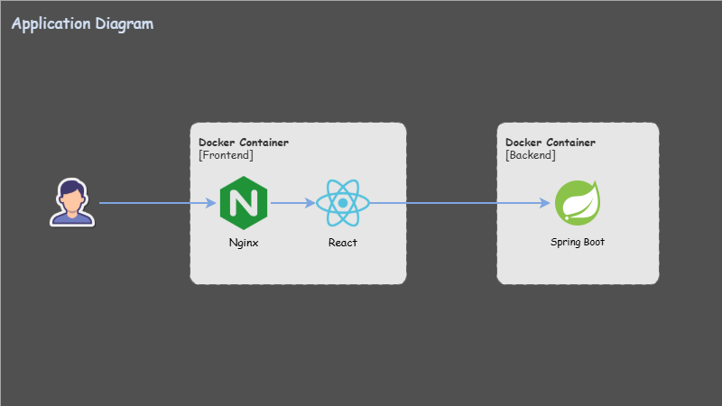
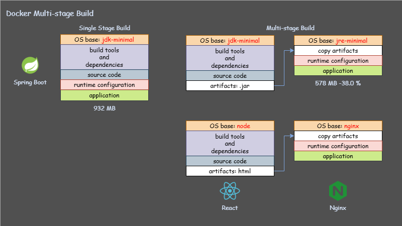
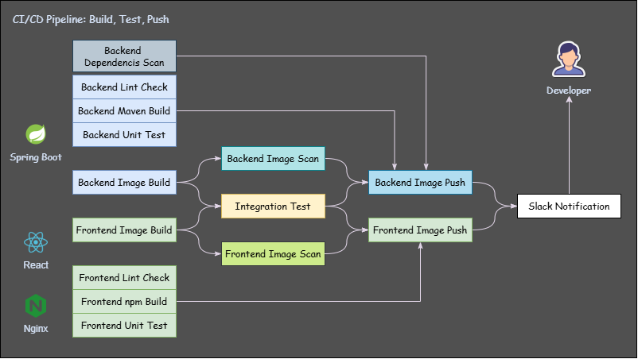
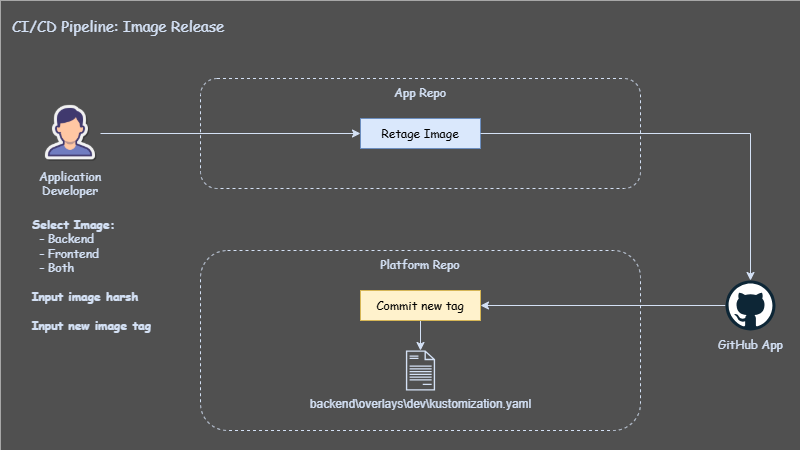

# GitOps Risk Control - Application Repository

**Validate Early. Release Gradually. Detect Fast.**

> A production-style GitOps project that reduces release risk across the delivery lifecycle.
> It validates changes through `multi-repo` and `multi-environment promotion`, releases gradually with `canary deployment`, and detects post-release issues through **monitoring** and **alerting**.

         
         

- [GitOps Risk Control - Application Repository](#gitops-risk-control---application-repository)
  - [Challenge and Solution](#challenge-and-solution)
  - [What This Application Repo Manages](#what-this-application-repo-manages)
    - [Full-Stack Web Application](#full-stack-web-application)
    - [Multi-Stage Docker Build](#multi-stage-docker-build)
    - [Automated CI/CD Pipelines and Image Delivery](#automated-cicd-pipelines-and-image-delivery)

---

## Challenge and Solution

**Challenge:**

Every production release carries the risk of introducing **bugs that affect users and disrupt business operations**.  
How can changes be **validated early**, **released gradually**, and **monitored continuously** to reduce business impact?

**Solution:**

This project implements a **GitOps-based release risk control workflow** across three phases:

| Phase        | Project Approach                                                                                           | Goal                                              |
| ------------ | ---------------------------------------------------------------------------------------------------------- | ------------------------------------------------- |
| Pre-release  | Separate responsibilities with dedicated repositories and isolated `dev`, `stage`, and `prod` environments | Catch issues early before they reach production   |
| Release      | Use `canary deployment` and automated rollout control                                                      | Limit the impact of failed releases               |
| Post-release | Monitor system health and trigger alerts after deployment                                                  | Detect incidents quickly and reduce recovery time |

- [Platform Repository](https://github.com/simonangel-fong/Project_GitOps_Risk_Control_Platform_Repo.git)
- [Application Repository](https://github.com/simonangel-fong/Project_GitOps_Risk_Control_App_Repo.git)
- [Infrastructure Repository](https://github.com/simonangel-fong/Project_GitOps_Risk_Control_Infra_Repo.git)

---

## What This Application Repo Manages

### Full-Stack Web Application

This repo contains a simple full-stack web application used as the deployable workload for the GitOps canary promotion workflow.

| Layer            | Technology  | Responsibility                                                     |
| ---------------- | ----------- | ------------------------------------------------------------------ |
| Backend          | Spring Boot | Provides RESTful APIs for the application                          |
| Frontend         | React       | Provides the user-facing web UI                                    |
| Containerization | Docker      | Packages the frontend and backend into deployable container images |

---

### Multi-Stage Docker Build

Multi-stage Docker builds separate build-time dependencies from runtime images, reducing image size and limiting what is shipped to production.

| Service  | Build Stage                                          | Runtime Stage                                | Benefit                                                                                |
| -------- | ---------------------------------------------------- | -------------------------------------------- | -------------------------------------------------------------------------------------- |
| Backend  | Maven builds the Spring Boot `.jar` with a JDK image | Runs the `.jar` with a lightweight JRE image | Removes build tools from the runtime image and reduces image size                      |
| Frontend | Node.js builds static React assets                   | Nginx serves the compiled static files       | Removes Node/npm from runtime and uses an unprivileged Nginx image for safer execution |

---

### Automated CI/CD Pipelines and Image Delivery

This repo uses CI/CD pipelines to validate application changes, build container images, scan artifacts, and hand off release versions to the Platform Repo for GitOps deployment.

| Stage                  | Automated Jobs                                                                             | Purpose                                                                                        |
| ---------------------- | ------------------------------------------------------------------------------------------ | ---------------------------------------------------------------------------------------------- |
| Code validation        | Lint check, unit test, dependency scan                                                     | Catch code quality, test, and dependency issues before building images                         |
| Integration validation | Docker Compose integration test                                                            | Verify the frontend, backend, and dependent services can run together before release           |
| Image delivery         | Docker build, image scan, Docker push                                                      | Build trusted application images, scan for vulnerabilities, and publish images to the registry |
| Release version update | Human approval, image retag, commit updated image tag to Platform Repo Kustomize manifests | Control release version handoff while keeping deployment managed by GitOps                     |

- **Build, Test, Push**:

  

- **Release**:

  
